# Multi-Controller Quadrotor Trajectory Tracking
**PID vs. Discrete-Time LQR vs. Constrained MPC**

This repository provides a high-fidelity benchmarking suite for a 12-DOF non-linear quadrotor system. It compares three distinct control architectures—Cascaded PID, Discrete-Time LQR, and Model Predictive Control (MPC)—across complex 3D trajectories (Helix and Lemniscate) under both ideal and stochastic wind conditions.

---

## 1. Benchmarking Results

The suite executes four standardized test cases to evaluate tracking precision (RMSE) and efficiency (Control Effort). 

### Performance Metrics Summary
| Test Case | Controller | RMSE (m) | Control Effort |
| :--- | :--- | :---: | :---: |
| **Helix (No Wind)** | **MPC** | **0.0174** | **18,117** |
| | LQR | 0.0789 | 18,134 |
| | PID | 0.0882 | 36,166 |
| **Helix (Windy)** | **MPC** | **0.2512** | **16,459** |
| | LQR | 0.3078 | 16,466 |
| | PID | 0.3223 | 32,825 |
| **Lemniscate (No Wind)** | **MPC** | **0.0616** | **12,345** |
| | LQR | 0.2292 | 12,412 |
| | PID | 0.2731 | 24,449 |
| **Lemniscate (Windy)** | **MPC** | **0.2934** | **11,176** |
| | LQR | 0.4157 | 11,236 |
| | PID | 0.4390 | 22,084 |

### Visual Analysis

#### Case 1: Helix Trajectory (No Wind)
| 3D Path | Tracking Error |
| :---: | :---: |
| 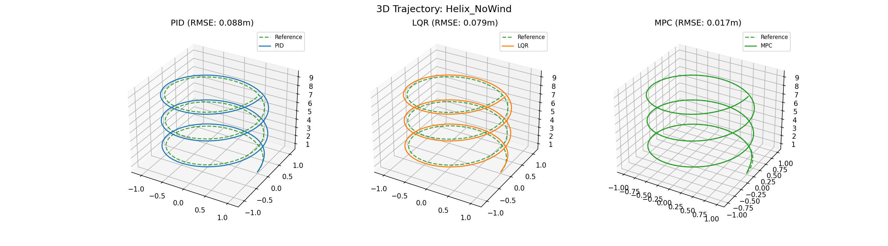 | 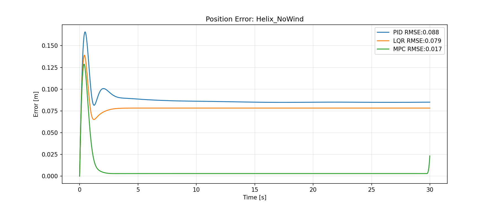 |
| **Rotor Forces** | **Benchmark Summary** |
| 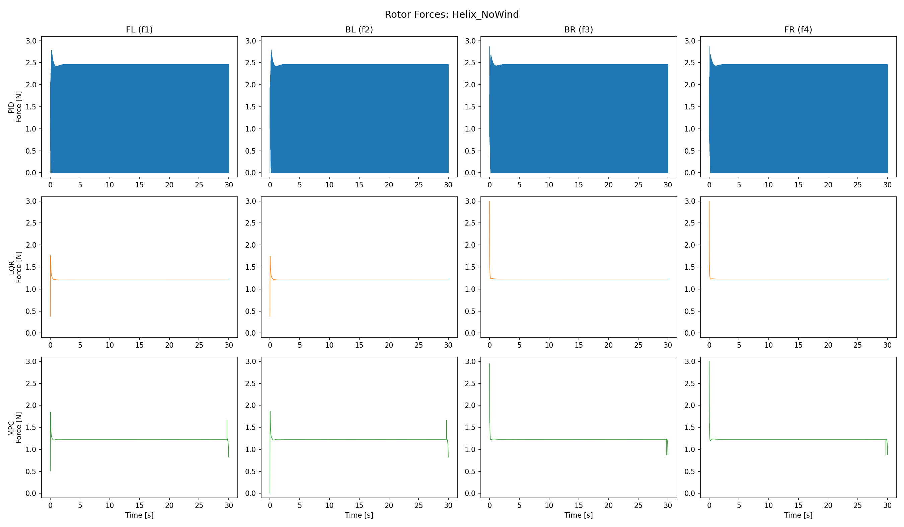 | 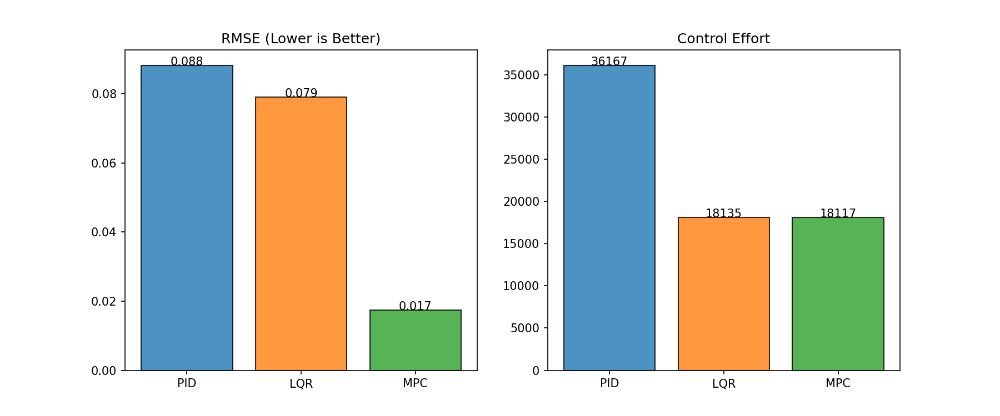 |

#### Case 2: Helix Trajectory (Stochastic Wind)
| 3D Path | Tracking Error |
| :---: | :---: |
| 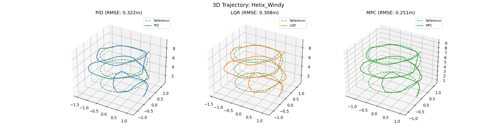 | 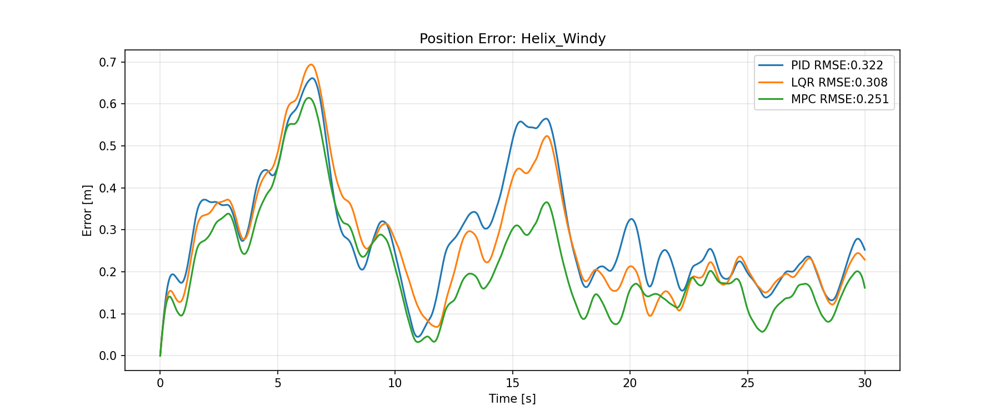 |
| **Rotor Forces** | **Benchmark Summary** |
| 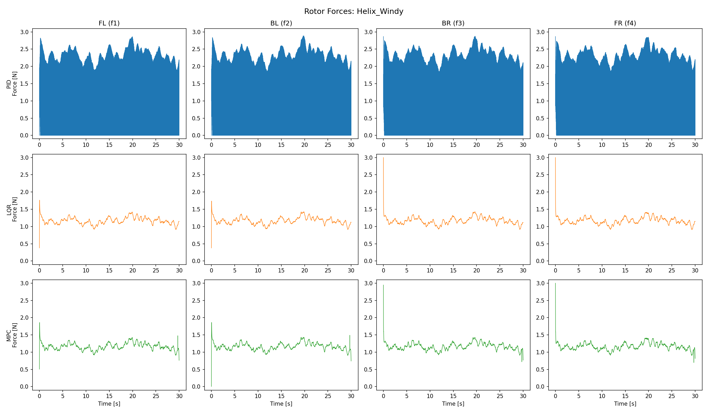 | 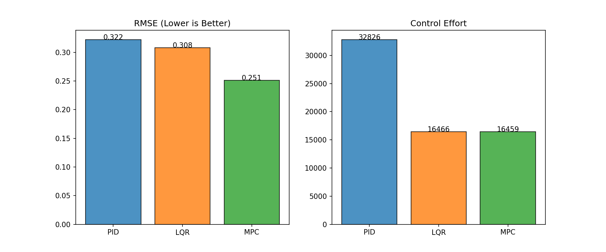 |

#### Case 3: Lemniscate Trajectory (No Wind)
| 3D Path | Tracking Error |
| :---: | :---: |
| 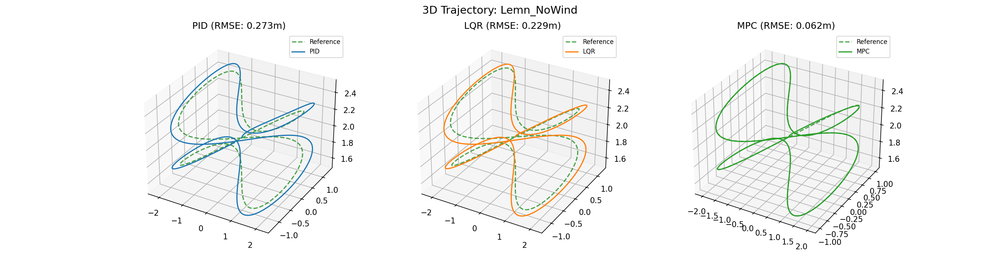 | 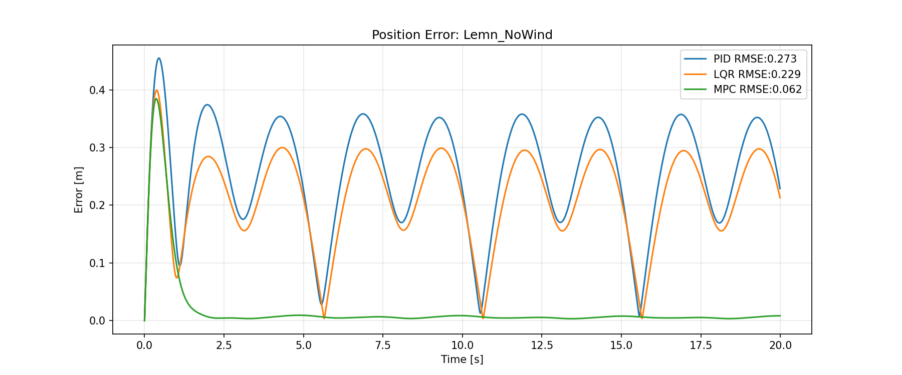 |
| **Rotor Forces** | **Benchmark Summary** |
| 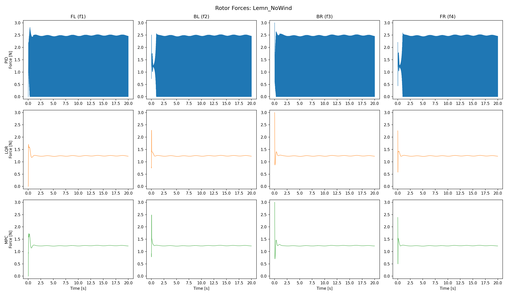 | 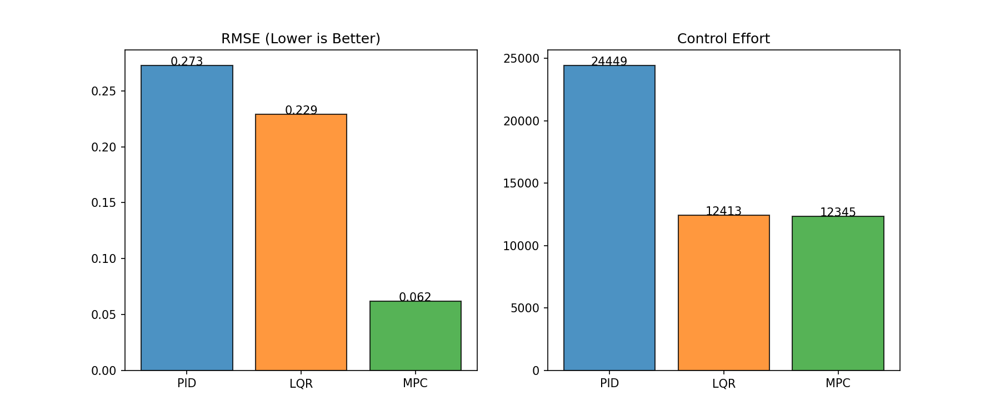 |

#### Case 4: Lemniscate Trajectory (Stochastic Wind)
| 3D Path | Tracking Error |
| :---: | :---: |
| 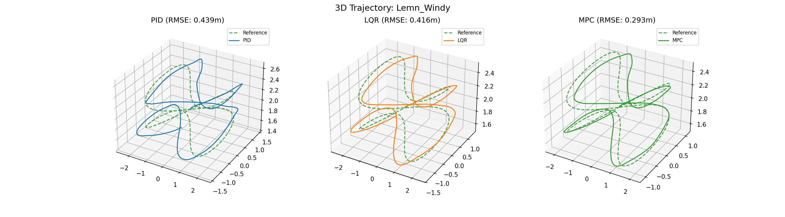 | 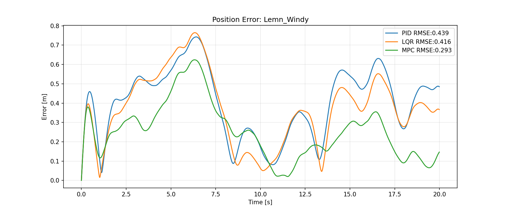 |
| **Rotor Forces** | **Benchmark Summary** |
| 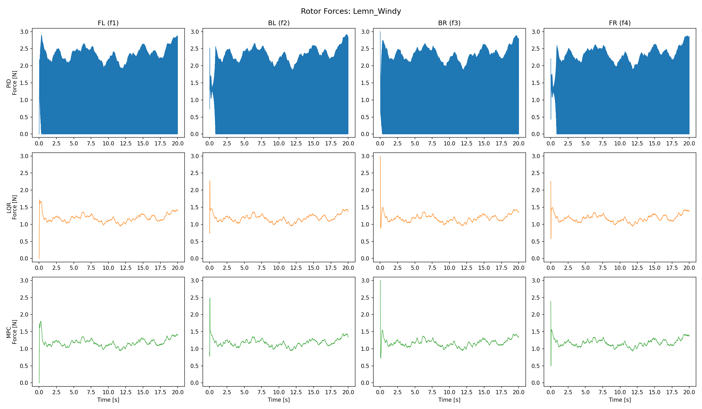 | 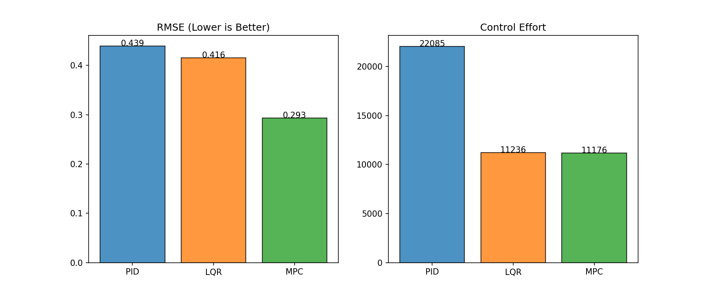 |

---

## 2. Technical Implementation

### Quadcopter Dynamics
The system is modeled as a 12-state non-linear rigid body ($x, y, z, v_x, v_y, v_z, \phi, \theta, \psi, p, q, r$). The simulation uses a non-linear dynamics engine with **Runge-Kutta (RK4) integration** for high temporal accuracy. 

The translational dynamics follow:
$$\ddot{p} = \frac{1}{m} R(\eta) F_{thrust} - \begin{bmatrix} 0 \\ 0 \\ g \end{bmatrix} + \frac{1}{m} F_{wind}$$

### Linearized Model & Discretization
For LQR and MPC synthesis, the system is linearized at a stable hover equilibrium ($\phi, \theta \approx 0$). To bridge the gap between continuous physics and digital control, we apply **Zero-Order Hold (ZOH) discretization** to the state-space matrices ($A_c, B_c$) at a 100Hz control frequency:
$$x_{k+1} = A_d x_k + B_d u_k$$

### Controller Architecture
* **Cascaded PID:** Utilizes independent loops for position and attitude. While robust, it suffers from phase lag in high-curvature segments.
* **Discrete LQR:** Solves the **Discrete Algebraic Riccati Equation (DARE)** to obtain an optimal infinite-horizon gain matrix $K$. It improves efficiency but lacks constraint-awareness.
* **Constrained MPC:** Solves a Quadratic Program (QP) at every timestep using `cvxpy` and the `OSQP` solver. It respects physical motor limits ($f_{min}, f_{max}$) and utilizes **Differential Flatness** to map trajectory accelerations into predictive attitude references.

---

## 3. Repository Architecture

```text
├── controllers/
│   ├── base.py          # Abstract base class for telemetry and logging
│   ├── pid.py           # Cascaded Position/Attitude PID
│   ├── lqr.py           # Discrete LQR with feedforward
│   └── mpc.py           # Receding horizon MPC (N=30)
├── trajectories/
│   ├── helix.py         # 3D Helix analytical generator
│   └── lemniscate.py    # Figure-8 with analytical 1st/2nd derivatives
├── sim/
│   ├── quadrotor.py     # Non-linear dynamics and RK4 integrator
│   └── wind.py          # Gauss-Markov stochastic wind model
├── config.py            # Centralized hyperparameter and weighting management
└── run_benchmark.py     # Automated test-suite and visualization generator